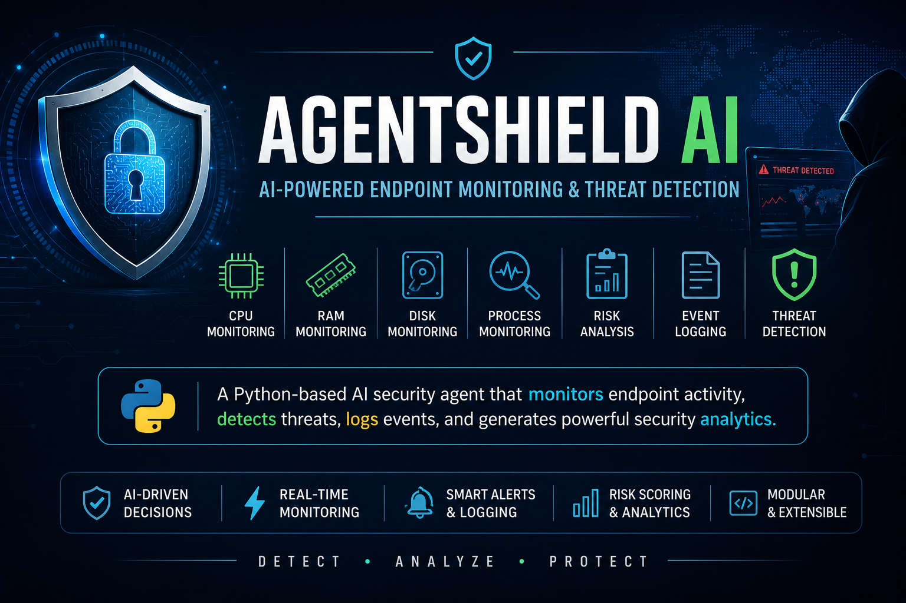
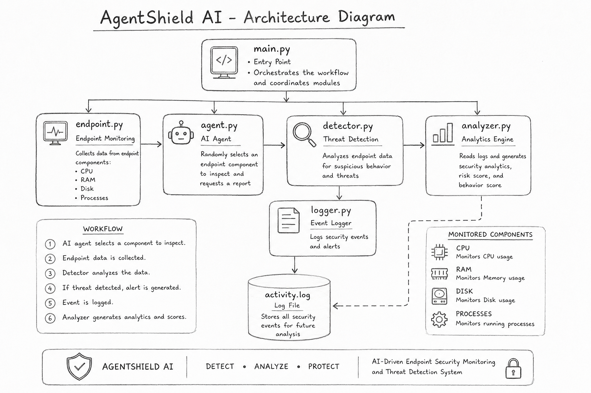

# 🛡️ AgentShield AI



An AI-driven endpoint monitoring system built in Python that simulates endpoint security, detects suspicious activity, logs security events, and generates security analytics.

## Project Overview

AgentShield AI is a Python-based cybersecurity project that simulates endpoint monitoring.

The system acts as an AI security agent that:

- Monitors endpoint activity
- Detects potential security threats
- Logs security events
- Analyzes historical activity
- Calculates a risk score
- Generates endpoint security analytics

## Features

- AI-driven endpoint inspection
- CPU monitoring
- RAM monitoring
- Disk monitoring
- Suspicious process detection
- Security event logging
- Threat severity classification
- Risk score calculation
- Security analytics
- Behavior scoring

## Project Structure

AgentShield/

── main.py
── endpoint.py
── agent.py
── detector.py
── logger.py
── analyzer.py
── activity.log
── README.md

## How AgentShield Works

1. The AI agent randomly selects an endpoint component to inspect (CPU, RAM, Disk, or Processes).

2. Endpoint data is collected through simulated monitoring functions.

3. The detector analyzes the collected data for suspicious behavior.

4. If a threat is detected, an alert is displayed and logged into `activity.log`.

5. The analyzer reads the log file and generates:

   - Endpoint statistics
   - Alert counts
   - Risk score
   - Risk level
   - Behavior score

## Demonstration

### CPU Monitoring


---

### Suspicious Process Detection


---

### Security Analytics


---

### System Architecture



## Technologies Used

- Python 3
- Python Standard Library (random)
- File Handling
- Modular Programming

## How to Run

1. Clone the repository.

2. Open the project folder.

3. Run:

```bash
python main.py
```

4. View the generated analytics in the terminal.


## Future Improvements

- Real-time system monitoring using psutil
- Interactive dashboard
- Live graphs and analytics
- Email alert notifications
- Machine learning-based threat detection
- Cloud log storage

## Project Goal

This project was built to simulate how modern cybersecurity tools:

- Monitor endpoint activity
- Detect abnormal behavior
- Generate risk-based insights

It demonstrates foundational concepts used in:

- Endpoint Detection & Response (EDR)
- Security Information and Event Management (SIEM)
- Behavioral threat analytics

## License

This project is intended for educational and learning purposes.